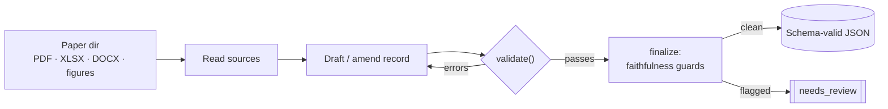

# vaxtract

[](https://pypi.org/project/vaxtract/)
[](https://pypi.org/project/vaxtract/)
[](LICENSE)
[](https://github.com/mskgreenbaumlab/vaxtract/actions/workflows/ci.yml)
<!-- DOI badge added after the first Zenodo release: [](https://doi.org/<DOI>) -->

Schema-validated extraction of **neoantigen cancer-vaccine immunogenicity data** from
primary papers, built on the [Claude Agent SDK](https://github.com/anthropics/claude-agent-sdk-python).
Point it at a folder of paper files (PDF / XLSX / DOCX) and it returns a
**schema-validated, provenance-tracked JSON** extraction (per-peptide / per-epitope
immunogenicity, HLA restriction, evidence, survival outcomes, …) for human sign-off.

> **Bring your own key (BYOK).** You run the agent and pay for your own Anthropic usage
> (~$3/paper, varies). Your files never leave your machine — there is no hosted service.

> **Output is _silver_, not gold.** Every record carries provenance and is meant for a
> curator to review before use, not to be treated as ground truth.

This is the open-source extraction engine behind the **NeoVax Atlas** — a curated database
of neoantigen cancer-vaccine trials. The agent's design and validation are described in the
accompanying paper (see [Citation](#citation)).

---

## Install

```bash
pip install vaxtract                    # core: the schema/vocab data contract only (pydantic)
pip install "vaxtract[agent]"           # + the extraction agent (Claude Agent SDK + readers)
pip install "vaxtract[agent,figures]"   # + figure/image reading (PyMuPDF + Pillow)
```

`pip install vaxtract` pulls only `pydantic`, so you can `import vaxtract.schema` to validate
records **without** the Claude Agent SDK. Running the agent (the `vaxtract` console script or
`vaxtract.extract_paper`) needs the `[agent]` extra.

Running the agent also requires Python ≥ 3.10 **and** the Claude Code CLI on your `PATH`
(the Agent SDK shells out to the `claude` binary):

```bash
npm install -g @anthropic-ai/claude-code
```

(The Docker image below bundles this for you.)

## Authenticate (pick one)

```bash
export ANTHROPIC_API_KEY=sk-ant-...     # A) API key — pay-per-token
# B) Claude subscription — pass --subscription to use a logged-in plan via the `claude` CLI
```

## Run

```bash
vaxtract ./my_paper_dir out.json
vaxtract --subscription ./my_paper_dir out.json   # use plan quota
```

`my_paper_dir` is a folder containing the paper's `.pdf` and any supplementary `.xlsx` /
`.docx`. The agent reads the tables/text/figures, builds the record, self-validates against
the schema, and writes `out.json`.

### As a library

```python
import asyncio
from vaxtract import extract_paper
asyncio.run(extract_paper("./my_paper_dir", "out.json"))
```

The data contract is importable without the SDK:

```python
from vaxtract.schema import ExtractedPaper, SCHEMA_VERSION
```

### Run with Docker

A prebuilt multi-arch image bundles Python, the agent, **and** the Claude Code CLI — bring only your key:

```bash
docker pull sahuno/vaxtract:latest
docker run --rm -e ANTHROPIC_API_KEY \
    -v "$PWD/my_paper_dir:/work/my_paper_dir" \
    sahuno/vaxtract:latest /work/my_paper_dir /work/my_paper_dir/out.json
```

## What it extracts

Per paper: studies, patients, immunizing peptides, minimal epitopes, pools, immunogenicity
evidence (assay / outcome / magnitude), neoantigen mutations, survival outcomes,
clinical-benefit signals, safety, and vaccine-delivery covariates — all validated against a
versioned Pydantic schema (`SCHEMA_VERSION`).

## How it works

The model is given **tools and a loop**: it reads tables/text/figures itself, drafts candidate
JSON, calls `validate()`, reads the schema's errors, and **fixes its own output** until the
record passes or an outer guard quarantines it for review. Pure logic (`agent_core.py`,
`prompt_render.py`) is SDK-free and unit-tested; the SDK shell wraps it as in-process tools.



See **[docs/ARCHITECTURE.md](docs/ARCHITECTURE.md)** for the full design.

## Reproducibility

The agent calls a proprietary, versioned, non-deterministic model, and the validation corpus
is copyright-restricted — so the gold `reference_records/` (audited extractions) are the
reproducibility anchor, not byte-identical re-runs. See **[REPRODUCIBILITY.md](REPRODUCIBILITY.md)**.

## Repository layout

| Path | What |
|---|---|
| `vaxtract/` | the package: schema (core) + the agent loop, tools, prompt rendering (`[agent]`) |
| `cancervac_packet/` | schema/vocab re-export shims + reporting + the pre-deploy validation gate |
| `tests/` | the test suite (`pytest`) |
| `reference_records/` | audited gold extractions — the validation set |
| `lite_extract/` | a lightweight prompt-only extraction variant + its RULES |
| `scale/` | optional HPC batch lane (Snakemake + Singularity), sanitized example config |
| `eval/` | extraction scoring (precision/recall vs gold) |
| `docs/` | architecture and schema documentation |

## Citation

If you use vaxtract, please cite it — see [`CITATION.cff`](CITATION.cff) (a DOI is minted on
release via Zenodo). A `.bib` entry will be added with the published paper.

## License

MIT © 2026 Samuel Ahuno
