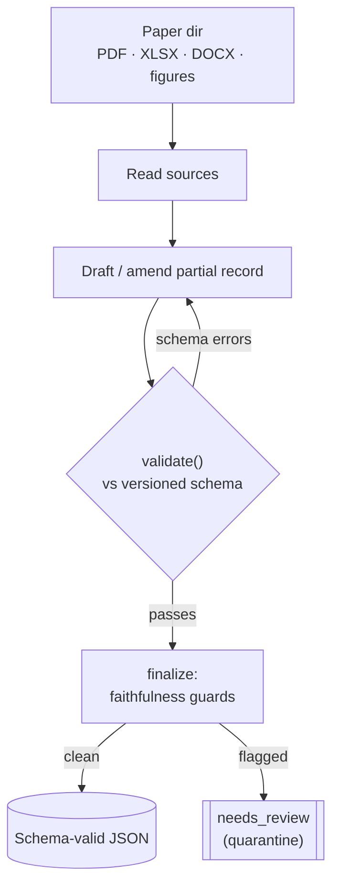
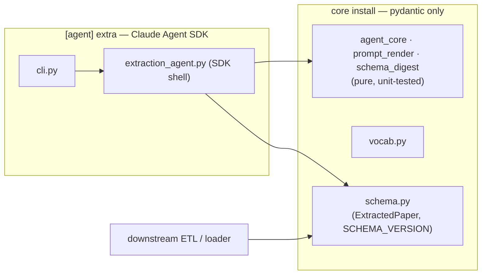
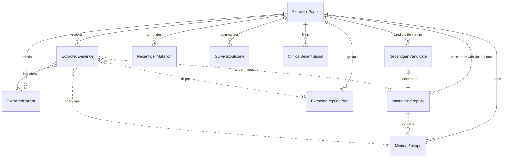

# vaxtract — Architecture

How the extraction agent is implemented. This is the companion to the paper's Methods section.

## 1. Overview

`vaxtract` turns a folder of primary-paper files (PDF + supplementary XLSX/DOCX, optionally
figures) into a single **schema-validated, provenance-tracked JSON** record describing a
neoantigen cancer-vaccine study at per-peptide / per-epitope grain.

It is an **agent**, not a prompt: the model is given a curated **toolset** and runs a **loop**.
It reads the tables/text/figures itself, drafts candidate JSON, calls `validate()`, reads the
schema's structured errors, and **repairs its own output** — iterating until the record passes
the schema or an outer guard quarantines it for human review.

## 2. The agent loop

- **Model:** `claude-opus-4-8[1m]` (the 1M-context variant). Large papers that would otherwise
  overflow the 200K window and trigger compaction (re-orientation churn, extra turns) run in a
  single context. 1M-tier pricing applies only above 200K tokens, so small papers are unaffected.
- **Turn / budget backstops:** `MAX_TURNS` (120) and a `max_budget_usd` ceiling guard against
  runaway runs.

## 3. Module layout — pure logic vs. SDK shell

A deliberate seam keeps the testable logic free of the SDK:

| Module | Role | Needs SDK? |
|---|---|---|
| `vaxtract/schema.py` | the Pydantic **data contract** (`ExtractedPaper`, `SCHEMA_VERSION`) | no (core) |
| `vaxtract/vocab.py` | controlled vocabularies, kept in lockstep with the schema | no (core) |
| `vaxtract/agent_core.py` | pure record-building / partial-state / parsing helpers | no |
| `vaxtract/prompt_render.py` | system-prompt + field-guidance rendering ("Layer-2" deltas) | no |
| `vaxtract/schema_digest.py` | compresses the schema into an in-prompt digest | no |
| `vaxtract/extraction_agent.py` | the **SDK shell**: wraps the above as in-process MCP tools, builds options, runs the loop | yes (`[agent]`) |
| `vaxtract/cli.py` | `vaxtract` console entry point | yes (`[agent]`) |

`import vaxtract.schema` works with **only `pydantic`** installed — `extract_paper` is exposed
lazily (PEP 562) so the data contract never drags in the agent dependencies. This is what lets a
downstream ETL pipeline validate records against the exact same schema the extractor produces,
with no SDK.

## 4. The toolset (in-process MCP tools)

The agent is restricted to a curated set of tools and is **headless-safe** — no host shell, and it
cannot read or write outside the paper directory you give it and the output path:

- **Readers:** `read_pdf_text` (paged, large-buffer), `read_table` (XLSX sheets, with
  filtering/column selection for oversized sheets), `read_docx`, `read_figure` (renders PDF pages
  to images for figure/manifest extraction; `[figures]` extra).
- **Record builders:** `init_partial`, the `add_*` family (including a positional `add_table` DSL),
  and deterministic builders for pools/evidence/cross-reactivity.
- **Validation:** `validate(partial)` returns the schema's errors so the model can self-correct;
  `finalize` applies the outer guards.

## 5. The schema as a single versioned contract

The output schema (`SCHEMA_VERSION`, currently 2.15.0) is the heart of the system. It encodes the
entity model (studies → patients → peptides/epitopes/pools → evidence → outcomes), controlled
vocabularies, and cross-field invariants. Because it is the **core** install, the same contract is
importable by any consumer — extractor, ETL loader, and tests all validate against one source of
truth rather than drifting copies. `cancervac_packet/predeploy_gate.py` shadow-validates every
record in a corpus against the current schema before any schema change ships.

The entity model, at the grain that distinguishes this resource (per-peptide / per-epitope, not
per-paper):

(Simplified: `ExtractedEvidence.target` is one of peptide / epitope / pool / candidate; nested
per-patient detail — `VaccineDelivery`, `ConcomitantTherapy`, response magnitudes — is omitted.)

## 6. Faithfulness & provenance

Every extracted fact carries provenance (`quoted_text` / source anchors), and a set of
**faithfulness guards** route under- or over-confident records to `needs_review` rather than
emitting them as clean. Examples: an evidence-anchor gap backstop catches a run that emits one
negative per screening-manifest row (over-enumeration); a regimen-divergence check flags
inconsistent per-patient vaccine regimens. The design goal is **silver** output — provenance-rich,
conservatively gated, and meant for a curator, never treated as ground truth.

## 7. Validation

- **Unit tests** (`tests/`, run with `pytest`) cover the pure logic, guards, schema invariants,
  and tool behaviours.
- **Gold reference records** (`reference_records/`) are audited extractions used as the
  reproducibility anchor and regression baseline.
- **Scoring** (`eval/`) computes precision/recall of an extraction against gold.

## 8. Scale lane (optional)

`scale/` provides an HPC batch lane (Snakemake driver + Singularity recipe) for extracting a
corpus of papers, one task per PMID, marker-resumable and quota-aware. The shipped config uses
placeholder paths — edit it for your cluster.
